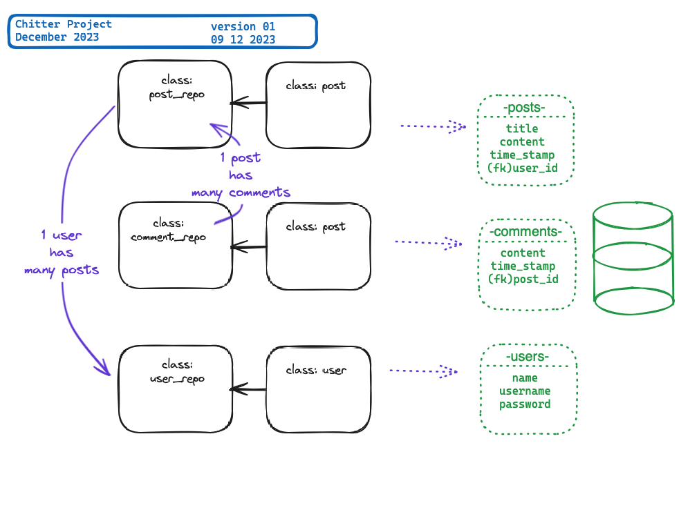

# === CHITTER === 
## Core design


### 1. User request

```
phase1
-------
I can let people know what I am doing
 >> post a message (peep) to chitter
I can see what others are saying
 >> see all peeps in reverse chronological order
I can better appreciate the context of a peep
 >> see the time at which it was made
I can post messages on Chitter as me
 >> sign up for Chitter


phase 2
--------
I can post messages on Chitter as me
 >> log in to Chitter
I can avoid others posting messages on Chitter as me
 >> log out of Chitter

phase 3
-------
I can stay constantly tapped in to the shouty box of Chitter
 >> receive an email if I am tagged in a Peep
```
### 2. Analsys
- post messages adding username
- retrive all messages showing main message and comments with usernames
- and add timestamp too
- add sign up functionality
- using log in and out
- add messaging service (advanced)


### 3. Design the Class System
>...\
>user_repository\
>user\
>post_repository\
>post\
>comment_repository\
>comment\
>...



_excalidraw.com_


```
METHODS:
user_repository
    all
    find
    create
user
    __eq__
    __repr__
post_repository
    all
    find
    create
post
    __eq__
    __repr__
comment_repository
    all
    find
    create
comment
    __eq__
    __repr__
```
.\
.\
.
### 4. Implement code
```python
class user():
    # -> id, name, username, password
    # ACTION: check username lenght >= 3 & <= 12, only alpha chars, and set to be unique. ( it needs implementation with database-query)  
    # ACTION: check valid password=> can contain the chars %&!?,
    #    must be longer than 10 chars and contain at least 1 number

    def is_valid_username():
        # <- username
        # exe: check len >= 3 & <= 12, alphanumeric chars only,
        #       not startitng with a number
        #       call external function to check for uniqueness
        # -> True or False

    def is_valid_password():   # => check password validity
        # <- password
        # exe: check len >= 10 & <= 20, alpha chars + %&!?, 
        #       must have 1+ digit
        # -> True or False

    __eq__   # => for testing only 

    __repr__ # => for testing and CLI printout
#-------------------
class user_repository():
    # -> connection

    def all()
        # <- None
        # exe: fetch data
        # -> a list of user instances
        pass
    def find()
        # <- user id
        # exe: fetch data - 1 entry
        # -> 1 instance of user
        pass
    def add()
        # <- 1 user instance
        # exe: input data - 1 entry
        # -> None
        pass

#-------------------
class post():
    # -> id, title, content, time_stamp, user_id
    # ACTION: check and trunc content if lenght < 30 adding full stop
            # remove empty spaces from both side
            # CAP first letters of each words
    # ACTION: check and trunc content if lenght <= 200  adding "..."
            # remove empty spaces from both side
            # CAP first letter
    # ACTION: add timestamp

    def format_title():
        # <- title
        # exe: check len <= 30 and modify accordnly
    
    def format_content():
        # <- content
        # exe: check len <= 200 and modify accordnly
    
    def add_timestamp():
        # returns timestamp, for ie:2023-12-23 12:20

    __eq__   # => for testing only

    __repr__ # => for testin and CLI printout

#--------------------------
class post_repository():
    # -> connection

    def all()
        # <- user_id
        # exe: fetch data
        # -> a list of post instances
        pass

    def find()
        # <- post id, user id
        # exe: fetch data - 1 entry
        # -> 1 instance of post (connected to user)
        pass

    def add()
        # <- 1 post instance
        # exe: input data - 1 entry
        # -> None
        pass

#-------------------
class comment():
    # -> id, content, post_id
    # ACTION: check and trunc content if its lenght <= 200 adding "..."
            # remove empty spaces from both side
            # CAP first letter
    
    def format_content():
        # <- comment
        # exe: check len <= 200 and modify accordnly

    __eq__   # => for testing only

    __repr__ # => for testin and CLI printout
#-------------------------
class comment_repository():
    # -> connection

    def all()
        # <- post_id
        # exe: fetch data
        # -> a list of comment instances
        pass
    def find()
        # <- comment id, post_id
        # exe: fetch data - 1 entry
        # -> 1 instance of comment (connected to post)
        pass
    def add()
        # <- 1 comment instance
        # exe: input data - 1 entry
        # -> None
        pass
#-------------------

```

### 5. Testing
>
#### a. Create Examples as Unit Tests

_List of tests of the behaviour of each relevant class at a more granular level of detail._

```python
CLASS USER
"""
given a correct id, name, username and password
returns true and store a correct instance
"""
user = User(1, "Peter Pan", "petpan", "password123")
str(user) # => "User(Peter Pan, trpan, password123)"

"""
given 2 instance of user
returns true if the 2 instances contains same values
"""
user1 = User(1, "Peter Pan", "petpan", "password123")
user2 = User(1, "Peter Pan", "petpan", "password123")
user1 == user2 # => True

"""
given an incorrect username and/or incorrect name and/or incorrect password
returns False or True accordingly
"""
user = User(1, "Peter Pan", "pn", "password123")
user.is_valid  #=> False
user = User(1, "Peter Pan", "peter32", "password32")
user.is_valid  #=> True
user = User(1, "Peter Pan", "peter32", "passw£!?d123")
user.is_valid  #=> True
[...]

"""
give a name or a username with an empty space at the begining or the end
returns username without spaces
"""
user = User(1, "  Peter Pan ", " peter23 ", "password123")
user.name # => "Peter Pan"
user.username  # => "peter23"

"""
give an username with an empty space in between 2+ words
check for an input with a single word
returns False
"""
user = User(1, "Peter Pan", " peter 23 ", "password123")
user.is_valid # => False
user = User(1, "Peter Pan", " peter23 ", "password123")
user.is_valid # => True

"""
give an password with:
    wrong chars,
    too short or too long,
    not including special chars without '%','&','!','?',
    not containing at least 1+ digit
returns False
"""
user = User(1, "Peter Pan", "peter23", "pa")
user.is_valid() == False
user = User(1, "Peter Pan", "peter23", "passwordtoolongtoolong")
user.is_valid() == False
user = User(1, "Peter Pan", "peter23", "password123")
user.is_valid() == False
[...]

"""
given an incorrect username and/or incorrect name and/or incorrect password
returns an "error message" accordingly
"""
user = User(1, "Peter Pan", "pn", "password123")
user.generate_errors  #=> username too short
user = User(1, "Peter Pan", "peter32", "passwo")
user.generate_errors  #=> password too short
user = User(1, "Peter Pan", "peter32", "passwordpeter")
user.generate_errors  #=> incorrect password
[...]
```
===================
```python
CLASS USER_REPOSITORY
"""
calling ALL() 
returns the right list of users
"""
# implement DB_CONNECTION first
"""
calling FIND()
given an USER ID  
returns instance of 1 user
"""
# implement DB_CONNECTION first
"""
calling ADD()
given 1 instance of user 
check for DB integrity
"""
# implement DB_CONNECTION first
```
===================
```python
CLASS POST
"""
given a correct id, title, content, user_id , #note: (timestamp to be added)
returns true and store a correct instance adding timestamp
"""
post = post(1, "My first post", "I knew that too many rings have been left in Middle Earth", 1)
str(post) # => "Post(My First Post, I knew that too many rings have been left in Middle Earth, (current timestamp: 2023-12-23 12:20), 1)"

```
===================
```python
CLASS POST_REPOSITORY

```

===================
```python
CLASS COMMENT

```
===================
```python
CLASS COMMENT_REPOSITORY

```


>>>>>> TO BE CONTINUED


#### b. Create Examples as Integration Tests
_Create tests for the classes being used together in different situations and combinations that reflect the ways in which the system will be used_

```python
"""
When we add two users
We see those users reflected in the tracks list
"""
user_repo = UserRepository()
t = T("Carte Blanche", "Veracocha")
t2 = T("Synaesthesia", "The Thrillseekers")
library.add(t_1)
library.add(t_2)
library.users # => [u_1, u_2]
```


## 5. Implement the Behaviour

_After each test you write, follow the test-driving process of red, green,
refactor to implement the behaviour._

